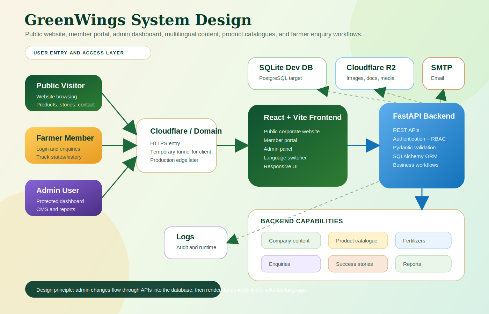
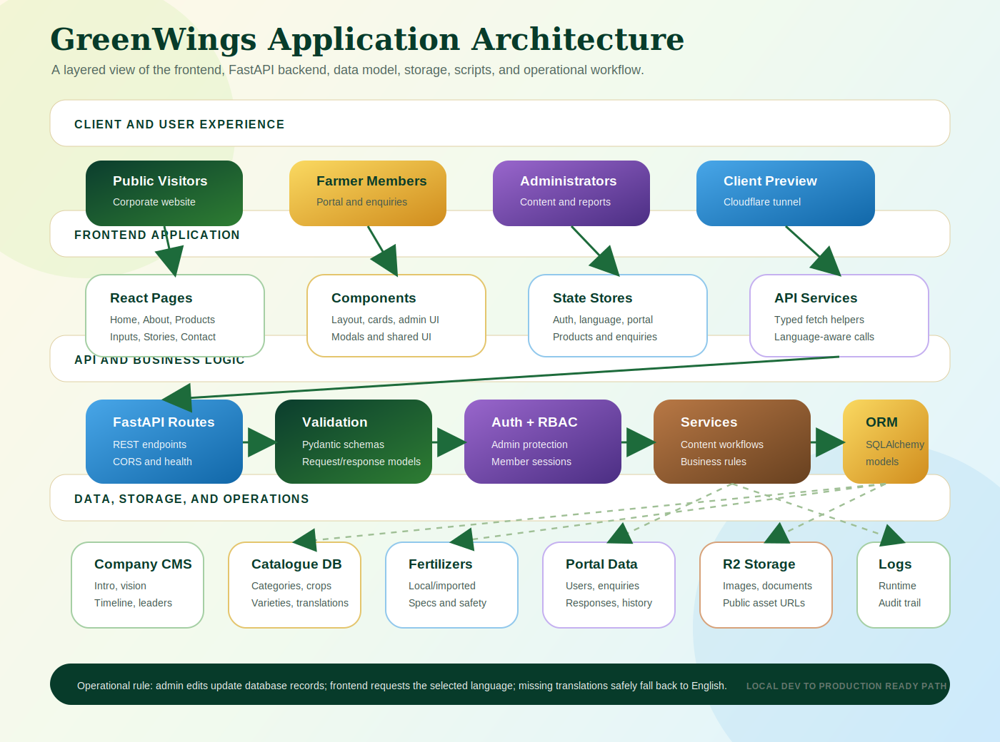

# GreenWings
Here we go...


GreenWings is a multilingual corporate website, member portal, agricultural catalogue, and admin management system for **GREEN WINGS FARMERS PRODUCER COMPANY LIMITED**, a Farmer Producer Organisation based in Jalgaon Neur, Yeola, Nashik, Maharashtra.

The platform is designed to help farmers, buyers, partners, and administrators interact with GreenWings through a modern public website, database-driven content, product information, enquiry workflows, and secured admin tools.

## Project Scope

- Public-facing GreenWings website
- Multilingual pages in English, Hindi, and Marathi
- Products catalogue for crops, varieties, and export produce
- Agricultural Inputs module for local and imported fertilizers
- Success stories and company content managed from the backend
- Member registration, login, enquiry creation, and enquiry tracking
- Admin dashboard for users, enquiries, content, fertilizers, stories, and reports
- Local development backend with FastAPI and SQLite
- Cloudflare R2-compatible image storage workflow
- PostgreSQL/Prisma planning assets for production expansion

## System Design



## Architecture



## Tech Stack

### Frontend

- React
- TypeScript
- Vite
- TailwindCSS
- React Router
- Zustand

### Backend

- Python
- FastAPI
- SQLAlchemy ORM
- Pydantic validation
- SQLite for local development

### Production Direction

- PostgreSQL
- Prisma ORM or SQLAlchemy migrations
- S3-compatible object storage, currently prepared for Cloudflare R2
- Secure authentication and role-based access control
- Managed deployment environment with secret storage

## Repository Structure

```text
greenwings-react/
  src/                         React frontend source
  public/                      Static public assets
  server/                      FastAPI backend, migrations, and scripts
  database/                    Local DB, seed data, SQL exports, and SPS source data
  prisma/                      Prisma schema planning
  docs/                        Technical documentation and ER diagrams
  logs/                        Runtime logs only
  archive/                     Reversible cleanup archive
```

For more detail, see:

- `PROJECT_STRUCTURE.md`
- `PROJECT_CLEANUP_PLAN.md`
- `PROJECT_CLEANUP_REPORT.md`

## Main Features

### Public Website

- Home
- About
- What We Do
- Products
- Agricultural Inputs
- Impact
- Stories
- Resources
- Contact

### Product Catalogue

The catalogue is database-driven and organized by crop category, crop, and crop variety.

Supported category structure:

- Fresh Fruits
- Grains & Cereals
- Millets
- Pulses & Lentils
- Fresh Vegetables
- Oil Seeds

The frontend can display translated product/category/variety data where available and safely falls back to English when a translation is missing.

### Agricultural Inputs

Agricultural Inputs are split into:

```text
Agricultural Inputs
|-- Local Fertilizers
|-- Imported Fertilizers
```

Each product can include:

- Product overview
- Nutrient content
- Benefits
- Suitable crops
- Unsuitable crops
- Application instructions
- Seasonal recommendations
- Safety precautions
- Product images
- Downloadable product documents

### Member Portal

Members can:

- Register
- Login
- Manage profile details
- Create enquiries
- Upload or add enquiry information
- Track enquiry status
- View enquiry history

### Admin Panel

Admin tools are visible only after admin authentication.

Admins can manage:

- Users
- Enquiries
- Company content
- Company timeline
- Leadership profiles
- Success stories
- Local fertilizers
- Imported fertilizers
- Product/catalogue content
- Multilingual content

## Multilingual Support

Supported languages:

- English (`en`)
- Hindi (`hi`)
- Marathi (`mr`)

Frontend language selection is stored locally. Backend APIs accept a `lang` parameter where multilingual records exist.

Examples:

```text
GET /api/content/about?lang=en
GET /api/content/about?lang=hi
GET /api/content/about?lang=mr
```

## Local Development

### 1. Install Node dependencies

```powershell
npm install
```

### 2. Create Python virtual environment

```powershell
python -m venv .venv
.\.venv\Scripts\python -m pip install -e .
```

### 3. Configure environment

Create a local `.env` from `.env.example` and fill only local development values.

Never commit real `.env` files.


### 4. Start backend

```powershell
npm run api
```

Backend health check:

```text
http://127.0.0.1:8787/api/health
```

### 5. Start frontend

In another terminal:

```powershell
npm run dev
```

Open:

```text
http://127.0.0.1:5173/
```

### Windows shortcut

You can also start the local app with:

```text
START_DEV_SERVER.cmd
```

## Useful Scripts

```powershell
npm run dev       # Start Vite frontend
npm run api       # Start FastAPI backend
npm run build     # TypeScript build and Vite production build
npm run lint      # ESLint validation
npm run preview   # Preview production build
npm run db:import # Import seed data into local SQLite database
```

On Windows PowerShell, if `npm` is blocked by execution policy, use:

```powershell
npm.cmd run build
npm.cmd run lint
```

## Database

Local development uses:

```text
database/greenwings.db
```

This file is local runtime data and must not be committed.

Important database areas:

- `database/sps/`: source CSV/image material used by upload and sync scripts
- `database/backups/`: local database backups
- `database/media-cache/`: generated image cache
- `server/migrations/`: migration and normalization scripts
- `prisma/schema.prisma`: production schema planning

## Cloudflare R2 Image Workflow

Image upload scripts use Cloudflare R2-compatible S3 APIs for storage.

Important rule:

- Uploads use `R2_ENDPOINT_URL`
- Frontend image display uses `R2_PUBLIC_BASE_URL`

Public image URLs should not include the bucket name unless the configured public domain requires it.

Example expected public URL shape:

```text
https://your-public-r2-domain.example/crop-varieties/image-name.jpg
```

## Client Preview Without Deployment

For temporary client testing, keep three terminals running.

### Terminal 1: Backend

```powershell
npm run api
```

### Terminal 2: Frontend

```powershell
npm run dev -- --host 127.0.0.1 --port 5173
```

### Terminal 3: Cloudflare Tunnel

```powershell
.\cloudflared-windows-amd64.exe tunnel --url http://127.0.0.1:5173
```

Cloudflare will print a temporary `trycloudflare.com` URL. Share only that URL with the client.

Notes:

- The link works only while the tunnel terminal stays open.
- This is for review/testing only, not production hosting.
- Do not expose `.env`, admin credentials, API tokens, or private database files.

## Validation

Run before pushing important changes:

```powershell
npm.cmd run build
npm.cmd run lint
python -m compileall server
git status --short --branch
```

Known current validation note:

- Production build passes.
- Python backend compilation passes.
- ESLint currently reports existing React hook lint issues in several admin/page components. These are documented in `PROJECT_CLEANUP_REPORT.md`.

## Git Safety Rules

Do not commit:

- `.env`
- `.env.*` except `.env.example`
- local SQLite databases
- Cloudflare executables
- Cloudflare temporary configs
- runtime logs
- generated cache files
- real API keys, passwords, tokens, or secrets

Use clear human commit messages, for example:

```bash
git commit -m "Organize project structure and update documentation"
```

## Production Readiness Notes

Before production deployment:

- Move local SQLite data into managed PostgreSQL
- Use managed secret storage
- Harden authentication and role-based access control
- Add email verification and production SMTP
- Add production rate limiting and audit log retention
- Use a custom domain for Cloudflare R2/public assets
- Add CI checks for build, lint, and backend tests
- Review and resolve existing ESLint hook warnings/errors
