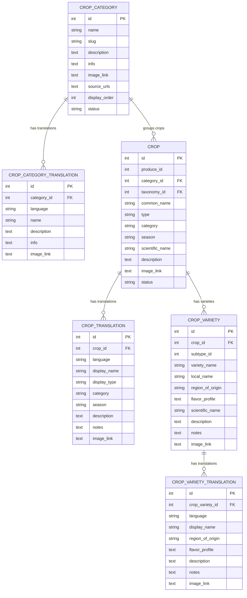

# GreenWings Crop Catalogue ER Diagram

This is the normalized product catalogue structure now used by the backend API.



## Category Hierarchy

1. Fresh Fruits
2. Grains & Cereals
3. Millets
4. Pulses & Lentils
5. Fresh Vegetables
6. Oil Seeds

## Query View

The SQLite database also contains `crop_category_variety_view` for quick reporting:

```sql
SELECT category_name, crop_name, variety_name
FROM crop_category_variety_view
ORDER BY category_id, crop_name, variety_name;
```

## Legacy Tables

The old `produce`, `produce_translations`, `subtypes`, and `subtype_translations` tables are retained for now as fallback/source history. The active API reads from the normalized tables above.
